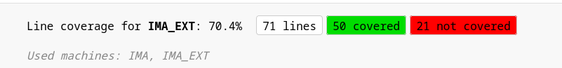
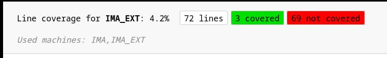
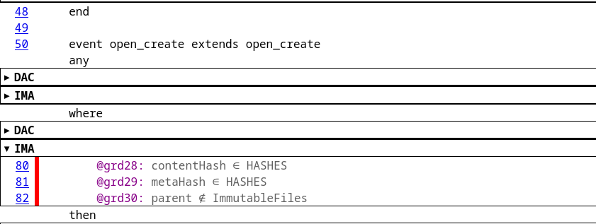
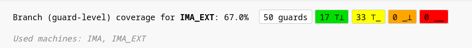
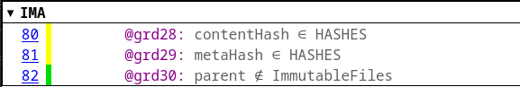
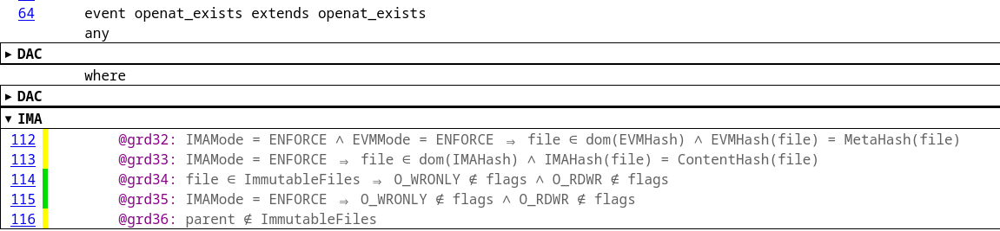
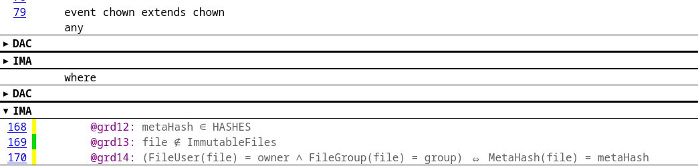
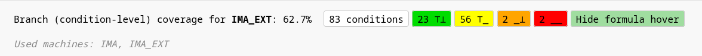
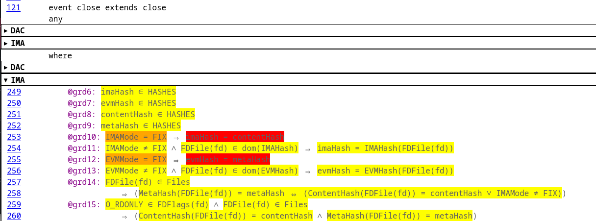

# Тестирование и покрытие

Тесты были написаны для основных функций, тестовые сценарии соответствуют методике тестирования:
- файлы с корректным сохраненным хэшем 
- файлы с корректным сохраненным хэшем + immutable

Изначально в методике тестирования были еще несколько пунктов, которые не удалось воспроизвести 
1. неконтролируемые подсистемой - данный тестовый сценарий не поддерживается реализованной моделью
2. файлы с некорректным хэш-кодом - данный тестовый сценарий выходит за рамки модели, так как хеши в модели меняются только при close, а в реальности невозможно заставить close выдать некорректный хеш (способы это исправить выходят за рамки модели, хоть и существуют)

## Покрытие по строкам составило **70.4%**

Но, как выяснилось, непокрытые строки отображаются некорректно - например, если запустить тест open_create, то покрытие по строкам составит **4%**:

но при этом сами строки отображаются красным

Также к непокрытым строкам относится код функций: fchmodat, fchownat, symlink, any_transition, mark\unmark_immutable. При этом все основные интересующие функции модели успешно покрыты. 

## Покрытие по branch-guard составило **67%**

Важно обратить внимание, что 33 условия принимают значение только истина. Большинство из этих условий невозможно покрыть ложным сценарием, например: 

1. HASHES - множество всевозможных хэшей - данное условие всегда истинно

2. условия, связанные с режимом работы IMA - так как в процессе тестирования режим динамически изменить нельзя, он устанавливается в ENFORCE

Но стоит обратить внимание, что условие 36 также помечено как только истинное, но это неверно. если запустить отдельно тест на open_exist с ложным условием 36, то оно будет окрашено в оранжевый цвет, из чего следует, что в данном случае цвет условия неверный и на самом деле тестовые сценарии покрывают оба варианта

3. условие 14 всегда истинно

## Покрытие branch-condition составило **62.7%**

1. Красные и оранжевые условия - условия в функции close. Это связано с тем, что тестирование происходит в режиме ENFORCE, а не FIX

2. остальные желтые условия аналогичны с неполными условиями при покрытии branch-guard

